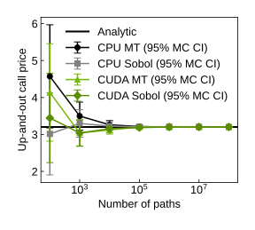
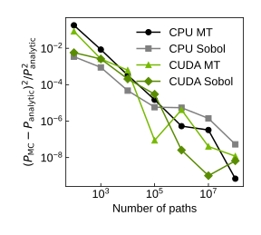
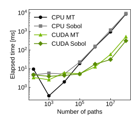

# Up-and-Out Barrier Option Pricing: Analytic, OpenMP, and CUDA

This repository compares a continuously monitored, zero-rebate European
**up-and-out call** under Black–Scholes/GBM using:

- a closed-form analytic price;
- native C++ Monte Carlo parallelized with OpenMP;
- CUDA Monte Carlo using cuRAND and a fused GPU payoff/moment reduction;
- a Python `ctypes` interface and convergence/benchmark plotting script.

Both Monte Carlo backends support Brownian-bridge survival weighting so that the
simulation targets the same continuously monitored contract as the analytic
formula. Discrete monitoring is also available.

> **Important:** CUDA `rng="sobol"` uses cuRAND scrambled Sobol64. CPU
> `rng="sobol"` is currently an MT-based fallback stream, not a true Sobol
> implementation.

## Model

Under the risk-neutral measure,

```text
dS_t / S_t = (r - q) dt + sigma dW_t.
```

For spot `S0`, strike `K`, upper barrier `H`, maturity `T`, rate `r`, and
continuous dividend yield `q`, the continuously monitored payoff is

```text
exp(-rT) max(S_T - K, 0) 1{max_{0<=t<=T} S_t < H}.
```

The analytic implementation uses the standard `A - B + C - D` decomposition
for an up-and-out call with `K < H` and zero rebate. The value is zero when
`S0 >= H` or `K >= H`.

### Brownian-bridge correction

With `x_i = log(S_i)`, `b = log(H)`, and `variance_step = sigma^2 dt`, the
conditional survival factor between two endpoints below the barrier is

```text
1 - exp[-2 (b - x_i) (b - x_{i+1}) / variance_step].
```

When `brownian_bridge=True`, the path payoff is multiplied by these interval
survival factors. This removes the main discrete-monitoring bias and makes the
Monte Carlo estimator comparable with the continuously monitored analytic
price.

When `brownian_bridge=False`, only the simulated time-grid values are checked,
so the result is a discretely monitored barrier price.

## Implementation

| Component | File | Main behavior |
|---|---|---|
| Analytic price and shared formulas | `src/barrier_common.hpp` | Double-precision closed form and validation |
| CPU Monte Carlo | `src/barrier_cpu.cpp` | OpenMP path parallelism, `std::mt19937`, fused normal generation/path evolution |
| CUDA Monte Carlo | `src/barrier_cuda.cu` | cuRAND normal generation, one thread per path, fused payoff and two-moment reduction |
| C ABI | `src/barrier_api.h` | Shared-library entry points used by Python |
| Python wrapper | `python/barrier_mc/pricing.py` | Library loading, CUDA runtime probe, validation, and CPU fallback |
| Comparison script | `scripts/run_comparison.py` | Price, normalized squared-error, and runtime plots |

### CPU backend

- Uses a static OpenMP path partition.
- Uses 32-bit `std::mt19937` and maps its high 24 bits through a float
  inverse-normal approximation.
- Fuses random-number generation and path evolution instead of storing a normal
  vector per path.
- Evolves log prices and Brownian-bridge weights in single precision.
- Accumulates payoff and squared-payoff moments in double precision.
- Consumes all `n_paths * n_steps` random values even after path knockout, which
  keeps the work definition consistent with the CUDA pipeline.
- Keeps `rng="sobol"` as a deterministic MT-based fallback with a separately
  mixed seed.

### CUDA backend

- Uses cuRAND MTGP32 for `rng="mt"`.
- Uses cuRAND scrambled Sobol64 for `rng="sobol"`, with one Sobol dimension per
  time step; the Python `seed` is used as the cuRAND sequence offset.
- Generates standard-normal floats directly with cuRAND.
- Stores normals in dimension-major order, so neighboring threads read
  neighboring values at each time step.
- Evolves path state and Brownian-bridge arithmetic in single precision.
- Uses the stable `-expm1f(exponent)` form for interval survival probabilities.
- Reduces payoff and squared payoff together in double precision within each
  block, then atomically accumulates the two global moments.
- Processes at most `2^18 = 262,144` paths per batch to bound peak GPU memory.
  Batches currently run sequentially.
- Pads odd MT normal-output lengths by one value to satisfy cuRAND's generation
  requirement; the padding value is ignored.

The reported `elapsed_ms` for both CPU and CUDA covers backend initialization,
simulation, result transfer, and cleanup after input validation.

## Requirements

- CMake 3.20+
- A C++17 compiler
- OpenMP, recommended for the CPU backend
- Python 3.10+
- NumPy, Matplotlib, and pytest
- CUDA Toolkit and cuRAND for the CUDA backend

The CUDA build defaults to architectures `75;80;86`. Override this when needed,
for example:

```bash
cmake -S . -B build -DBUILD_CUDA=ON -DCMAKE_CUDA_ARCHITECTURES=86
```

## Build

A single-configuration build defaults to `Release` when no build type is given.

### CPU only

```bash
cmake -S . -B build -DBUILD_CUDA=OFF
cmake --build build -j
```

### CPU and CUDA

CUDA is enabled when `BUILD_CUDA=ON` and CMake can find `nvcc`.

```bash
cmake -S . -B build -DBUILD_CUDA=ON
cmake --build build -j
```

The shared libraries are written under `build/lib` for single-configuration
generators:

```text
barrier_cpu.dll / libbarrier_cpu.so / libbarrier_cpu.dylib
barrier_cuda.dll / libbarrier_cuda.so / libbarrier_cuda.dylib
```

For a multi-configuration generator such as Visual Studio, build the Release
configuration explicitly and pass the actual library directory to
`BarrierPricer` if the generator places binaries in a configuration subfolder:

```bash
cmake --build build --config Release -j
```

## Run the comparison

The experiment parameters are written directly near the top of
`scripts/run_comparison.py`. The current defaults are:

- `S0 = 100`, `K = 100`, `H = 130`;
- `T = 1`, `r = 0.03`, `q = 0`, `sigma = 0.20`;
- path counts `10^2, 10^3, ..., 10^8`;
- 64 time steps;
- seed 42;
- Brownian bridge enabled.

Run:

```bash
python scripts/run_comparison.py
```

The script always evaluates CPU MT and CPU `sobol` fallback series. It adds CUDA
MT and CUDA Sobol series only when the CUDA runtime probe succeeds.

Each run prints the price, ordinary Monte Carlo standard error, elapsed time,
and normalized squared pricing error. It creates:

```text
results/price_convergence.svg
results/rmse_convergence.svg
results/runtime_comparison.svg
```

`rmse_convergence.svg` retains its historical filename, but the plotted quantity
is **not RMSE**. At each path count it is

```text
(MC price - analytic price)^2 / analytic price^2.
```

No square root or repeated-seed averaging is applied. The script rejects cases
where the analytic price is zero because this normalized quantity is undefined.

## Saved benchmark plots

The [`saved/`](saved) directory contains a committed example run of the three
plots. These figures were generated with the default contract parameters,
64 time steps, Brownian bridge enabled, seed 42, and path counts from `10^2` to
`10^8`. The analytic value for this run is `3.20274968`.

The runtime measurements were obtained on the documented test system with an
NVIDIA RTX A2000 12 GB GPU and an Intel Xeon W-2295 CPU. Runtime values should
therefore be interpreted as a representative implementation comparison rather
than portable hardware-independent benchmarks.

### Price convergence

<p align="center">
  <a href="saved/price_convergence.svg">
    
  </a>
</p>

The horizontal line is the continuously monitored analytic price. Each Monte
Carlo point shows the estimated option price and a `95%` confidence interval
computed as `price +/- 1.96 * standard_error`.

At small path counts, random sampling variation is large and the four series can
lie visibly above or below the analytic value. The confidence intervals contract
at approximately the usual `N^{-1/2}` Monte Carlo rate as the path count grows.
By `10^8` paths, all four estimates are close to the analytic price:

| Series | Price at `10^8` paths | Standard error |
|---|---:|---:|
| CPU MT | `3.20283390` | `5.864e-4` |
| CPU Sobol fallback | `3.20348751` | `5.865e-4` |
| CUDA MT | `3.20309965` | `5.864e-4` |
| CUDA Sobol | `3.20301074` | `5.863e-4` |

This agreement checks the consistency of the analytic implementation, the
Brownian-bridge correction, and the CPU/CUDA pricing paths. It does not imply
pathwise equality: each backend and RNG mode uses a different random stream.

### Normalized squared pricing error

<p align="center">
  <a href="saved/rmse_convergence.svg">
    
  </a>
</p>

The vertical axis is

```text
(P_MC - P_analytic)^2 / P_analytic^2,
```

so lower values mean that the sampled price happens to be closer to the analytic
price. Both axes are logarithmic.

This is a single-seed, pointwise squared error rather than an empirical RMSE over
independent replications. Consequently, the curves need not decrease
monotonically: a smaller run can land unusually close to the analytic value by
chance, while the next larger run can be farther away even though its estimator
variance is lower. A proper convergence-rate study should repeat each path count
with independent seeds or independent Sobol randomizations and average the
squared errors before taking a square root.

At `10^8` paths, the normalized squared errors in the saved run are:

| Series | Normalized squared error |
|---|---:|
| CPU MT | `6.9157e-10` |
| CPU Sobol fallback | `5.3073e-8` |
| CUDA MT | `1.1940e-8` |
| CUDA Sobol | `6.6444e-9` |

The ordering in this one run should not be read as a general ranking of RNG
quality. In particular, the CPU `sobol` label is an MT-based fallback and is not
a true quasi-Monte Carlo result.

### Runtime comparison

<p align="center">
  <a href="saved/runtime_comparison.svg">
    
  </a>
</p>

Both axes are logarithmic. The plotted time includes backend initialization,
random-number generation, path simulation, result transfer, and cleanup. For
small runs, fixed setup costs account for a substantial fraction of CUDA wall
time. At larger path counts the GPU reaches a steady-throughput regime and the
runtime grows approximately linearly with the total number of simulated path
steps.

Representative saved measurements are:

| Series | `10^7` paths | `10^8` paths |
|---|---:|---:|
| CPU MT | `941.80 ms` | `8537.23 ms` |
| CPU Sobol fallback | `1173.79 ms` | `9041.24 ms` |
| CUDA MT | `58.50 ms` | `518.66 ms` |
| CUDA Sobol | `30.92 ms` | `314.05 ms` |

At `10^8` paths, CUDA MT is about `16.5x` faster than CPU MT in this run. The
plotted CUDA Sobol series is about `28.8x` faster than the CPU series carrying
the `sobol` label, but that ratio is not an apples-to-apples RNG benchmark
because the CPU implementation uses its MT fallback while CUDA uses actual
scrambled Sobol64.

The near-constant time per path between `10^7` and `10^8` indicates that the
larger elapsed time is caused by proportionally more work, not a loss of GPU
occupancy. CUDA processes at most 262,144 paths per batch, so these large runs
require many sequential batches. Further details are in
[`notes/cuda_large_path_performance_analysis.md`](notes/cuda_large_path_performance_analysis.md).

To inspect CUDA visibility and the wrapper's runtime probe:

```bash
python scripts/check_cuda_env.py
```

The script also reports PyTorch CUDA information when PyTorch is installed;
PyTorch is not otherwise required by this project.

## Python API

Add the repository's `python` directory to `PYTHONPATH`, or insert it into
`sys.path`, then use `BarrierPricer`:

```python
import sys
from pathlib import Path

sys.path.insert(0, str(Path("python").resolve()))

from barrier_mc import BarrierParams, BarrierPricer

params = BarrierParams(
    spot=100.0,
    strike=100.0,
    barrier=130.0,
    maturity=1.0,
    rate=0.03,
    dividend_yield=0.0,
    volatility=0.2,
)

pricer = BarrierPricer("build/lib")
analytic = pricer.analytic(params)

cpu = pricer.monte_carlo(
    params,
    n_paths=262_144,
    n_steps=64,
    rng="mt",
    backend="cpu",
    seed=42,
    brownian_bridge=True,
)

if pricer.cuda_available:
    cuda = pricer.monte_carlo(
        params,
        n_paths=262_144,
        n_steps=64,
        rng="sobol",
        backend="cuda",
        seed=42,
        brownian_bridge=True,
    )
```

`MonteCarloResult` contains:

```text
price
standard_error
elapsed_ms
backend
rng
n_paths
n_steps
brownian_bridge
```

The CPU library is required. The CUDA library is optional. When CUDA is
requested but unavailable, the wrapper emits a `RuntimeWarning`, runs the CPU
backend, and records the backend actually used in `result.backend`. Check
`pricer.cuda_available` when a strict CUDA-only run is required.

A custom default library directory can be supplied through
`BARRIER_MC_LIB_DIR` when constructing `BarrierPricer()` without an explicit
path.

## Tests

Run all tests:

```bash
python -m pytest tests -q
```

Run only the CPU tests:

```bash
python -m pytest tests/test_cpu.py -q
```

CUDA tests cover both RNG modes, Brownian-bridge pricing, an odd
`n_paths * n_steps` MT request, and a discrete-monitoring comparison with CPU.
They skip cleanly when the CUDA library or runtime is unavailable.

## Numerical and statistical notes

- The analytic formula assumes constant `r`, `q`, and `sigma`, European
  exercise, continuous monitoring, and zero rebate.
- Path evolution is single precision for throughput; the analytic calculation
  and final payoff moments are double precision.
- The reported standard error is derived from the ordinary within-run payoff
  variance.
- The CUDA Sobol standard error should be treated as a heuristic. For
  research-grade randomized-QMC uncertainty estimates, run multiple independent
  randomizations/offsets and estimate variance across replications.
- CPU and CUDA RNG streams are not expected to produce pathwise-identical
  results. Compare prices statistically rather than sample by sample.

## Performance

The current implementation incorporates direct cuRAND normal generation,
coalesced dimension-major reads, single-precision path arithmetic, stable
Brownian-bridge evaluation, and a fused double-precision moment reduction.

On the documented NVIDIA RTX A2000 test system, representative median wall times
for 1,000,000 paths, 64 steps, and Brownian bridge enabled were approximately
`8.80 ms` for CUDA MT and `9.44 ms` for CUDA Sobol after optimization. These
numbers depend on GPU clock state, CUDA version, compiler, and system load and
should not be treated as portable benchmarks.

At large path counts, elapsed time grows approximately linearly because each
thread still evolves its time steps serially and the fixed-size batches execute
sequentially. Stable time-per-path at `10^7` and `10^8` paths indicates steady
throughput rather than loss of GPU occupancy.

See [`notes/cuda_large_path_performance_analysis.md`](notes/cuda_large_path_performance_analysis.md)
for the original bottleneck investigation, implemented optimizations, validation
results, and extended large-path measurements.